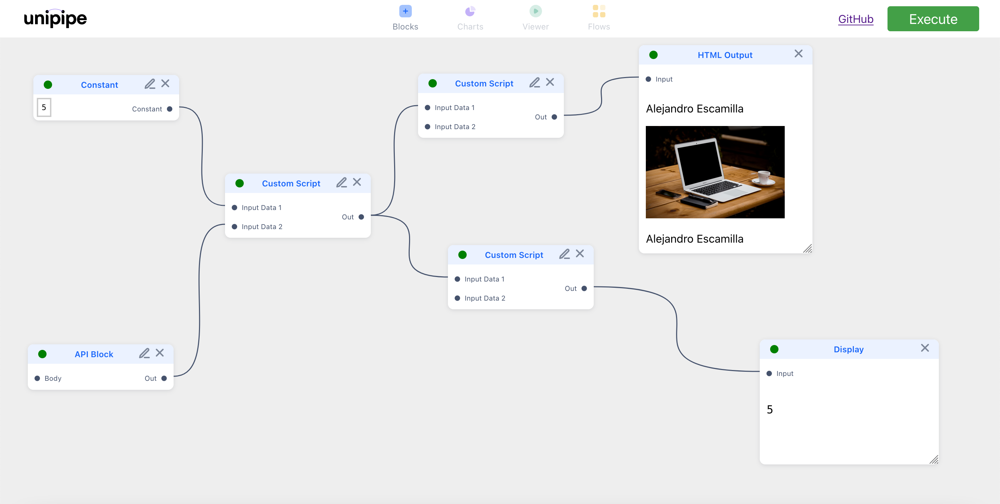

# unipipe

unipipe = **uni** (universal) + **pipe**


Design Credits: Sreekar Pradyumna

A tool to build generic flows to automate stuff. Inspired by Unix's pipe system and the concept of functional programming. Currently supports JavaScript processors, WIP for generic ones.

### Currently available blocks

| Name          | Description                                                    |
| ------------- | -------------------------------------------------------------- |
| API           | Supports all REST calls                                        |
| Custom Script | Write custom JavaScript to modify data                         |
| Add           | Addition                                                       |
| Square        | Square a number                                                |
| Factorial     | n!                                                             |
| Conditional   | Provide a condition and branch logic as per the boolean result |
| Constant      | Block emitting a constant value                                |
| Regex Match   | Regular expression matching to input data                      |
| Display       | (Sink) Displays input value on the screen                      |
| HTML Output   | (Sink) Renders HTML on screen                                  |
| Chart Output  | (Sink) WIP, displays charts as per input data                  |

Still in process of deciding a good way to abstract element processing functions.



To develop locally:

```bash
npm install
npm start
```
