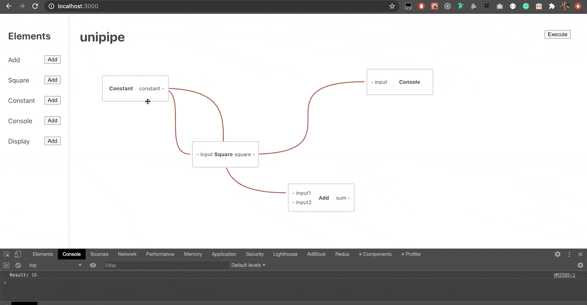

# unipipe

unipipe = **uni** (universal) + **pipe**



A tool to build generic flows to automate stuff. Inspired by Unix's pipe system and the concept of functional programming. Currently supports very basic JavaScript processors, WIP for generic ones.

Still in process of deciding a good way to abstract element processing functions.

To develop locally:

```bash
npm install
npm start
```
